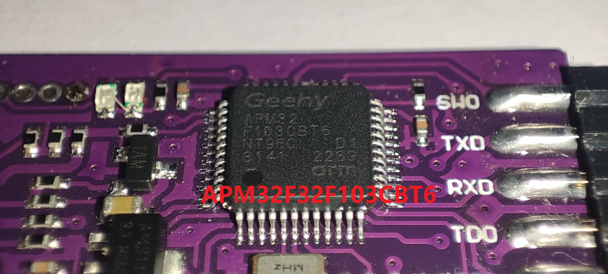
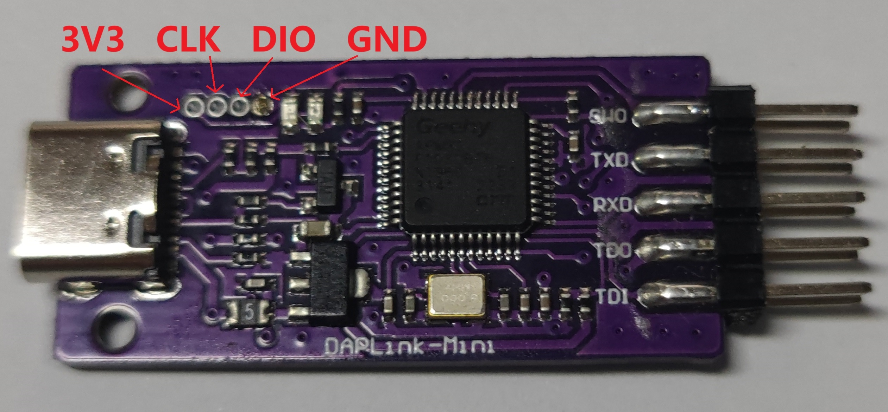
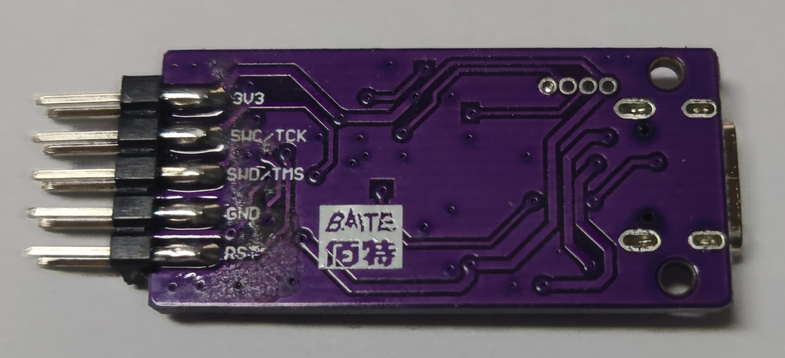

# daplink-to-stlinkv2.1
一种将特定daplink改为stlinkV2.1的方法（亲测管用，使用起来没有任何问题）

stlinkV2.1与daplink功能相似，同样拥有虚拟串口，但是市面产品很少，而且贵

而daplink又与STM32CubeIDE兼容性很差，故萌生了将daplink改为stlinkV2.1的想法

daplink与stlinkV2.1硬件结构基本相似，唯一影响的是主控的flash至少需要128K，因为固件大小是128K，但是市面上大部分的daplink都为国产小内存芯片，需要手动更换。实测原厂的STM32F103CBT6肯定没有问题，国产兼容的APM32F32F103CBT6, Air32F103CBT6没有问题，GD的存疑

所以可以通过更改daplink的主控并重新烧录固件达到更改的目的

有没有更简单的方案？答案是有的，亲测下面的一款daplink由于直接采用了APM32F32F103CBT6为主控芯片，并引出了烧录口，所以非常方便的将bin文件烧录其中。

左上角是烧录引脚，从左到右依次为3V3  CLK  DIO  GND ,烧录的时候只需要接入CLK与DIO即可，用板子的type-c供电即可

接着可以用daplink的U盘拖拽烧录模式，将.bin文件拖入daplink的虚拟U盘里面，实现自动烧录，从而用一个daplink把另一个daplink变为stlink，当然也可以使用STM32 ST-LINK Utility或STM32TrustedPackageCreator工具烧录.bin文件。

注意认准这款daplink，其他的daplink没有128k的flash。

